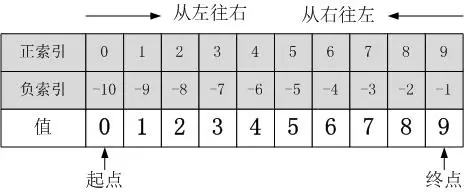

# Python 切片操作说明

## Python可切片对象的索引方式

包括：正索引和负索引两部分，如下图所示，以a = [0, 1, 2, 3, 4, 5, 6, 7, 8, 9]为例：


## Python切片操作的一般方式

一个完整的切片表达式包含两个“:”，用于分隔三个参数(start_index、end_index、step)，当只有一个“:”时，默认第三个参数step=1。

```
切片操作基本表达式：  
object[start_index:end_index:step]
```

step：正负数均可，其绝对值大小决定了切取数据时的‘‘步长”，而正负号决定了“切取方向”，正表示“从左往右”取值，负表示“从右往左”取值。当step省略时，默认为1，即从左往右以增量1取值。“切取方向非常重要！”

start_index：表示起始索引（包含该索引本身）；该参数省略时，表示从对象“端点”开始取值，至于是从“起点”还是从“终点”开始，则由step参数的正负决定，step为正从“起点”开始，为负从“终点”开始。

end_index：表示终止索引（不包含该索引本身）；该参数省略时，表示一直取到数据“端点”，至于是到“起点”还是到“终点”，同样由step参数的正负决定，step为正时直到“终点”，为负时直到“起点”。
